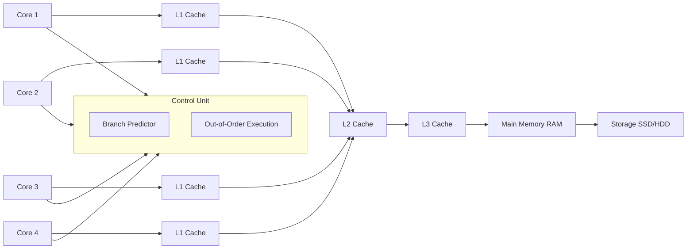
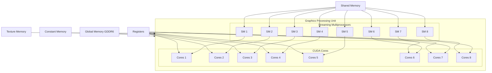
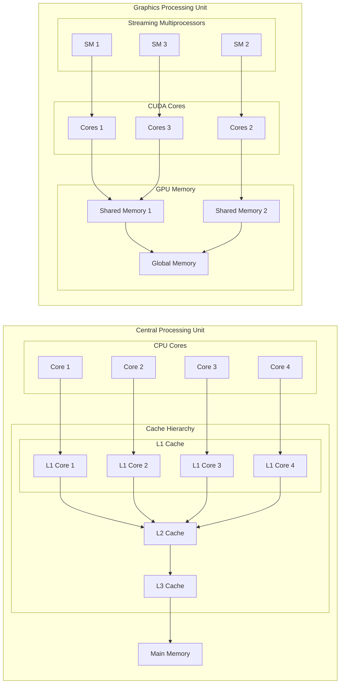
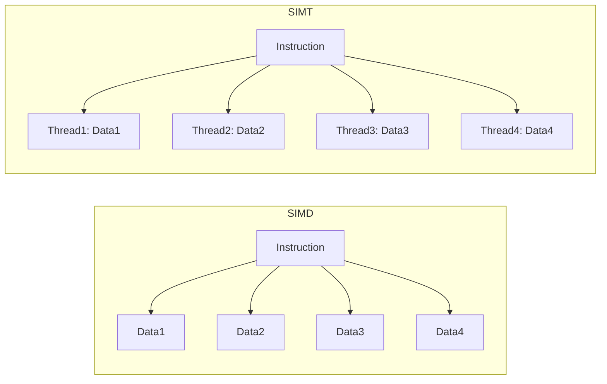
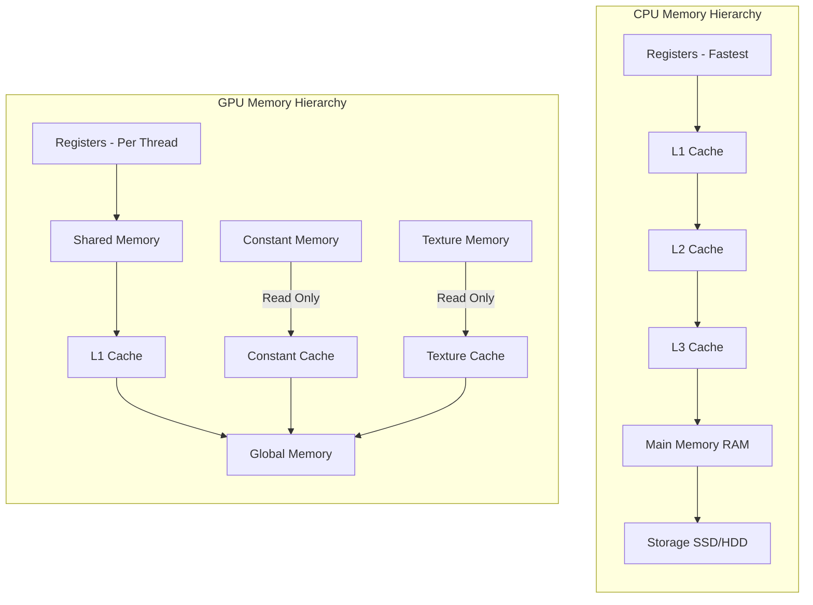

# cpu-vs-gpu

Let's compare the CPU and GPU performance on a simple task.

Firstly, let's check some of the CPU fundamentals.

## CPU Fundamentals

### a) **Core Components**
- **Cores**: Modern CPUs range from 2 to 64 cores, optimized for high single-threaded performance.
- **Cache Hierarchy**:
  - **L1 Cache**: Fastest and smallest (16-64 KB per core), directly connected to each core.
  - **L2 Cache**: Larger and slightly slower (256-512 KB per core), serving as a bridge between L1 and L3.
  - **L3 Cache**: Shared among all cores (several MB), providing a larger pool of cached data.
- **Branch Prediction & Out-of-Order Execution**: Enhances performance by predicting future instructions and executing instructions out of order to optimize pipeline usage.
- **Instruction Pipelines**: CPUs execute instructions through highly optimized pipelines, allowing for complex instruction sets and rapid context switching.

### b) **Strengths**
- **Low Latency**: Optimized for tasks requiring quick response times.
- **Complex Control Flow**: Handles branching and diverse instruction sets efficiently.
- **Single-Threaded Performance**: Excels at tasks that cannot be easily parallelized.

### c) **Conceptual Diagram: CPU Architecture**


## GPU Fundamentals

### a) **Core Components**
- **Streaming Multiprocessors (SMs)**: Comprise hundreds to thousands of lightweight cores designed for parallel tasks.
- **CUDA Cores**: The fundamental processing units within SMs, optimized for executing simple, repetitive tasks concurrently.
- **Memory Hierarchy**:
  - **Global Memory**: Large but high-latency memory accessible by all threads.
  - **Shared Memory**: Fast, on-chip memory shared among threads within a block.
  - **Registers**: Per-thread storage for quick access to variables.
  - **Constant & Texture Memory**: Specialized read-only memory for specific access patterns.
- **Warp Scheduling**: Groups of 32 threads (a warp) are scheduled together to execute the same instruction simultaneously.

### b) **Strengths**
- **High Throughput**: Capable of executing thousands of threads concurrently.
- **Data Parallelism**: Ideal for tasks that can be broken down into identical operations on large datasets.
- **Memory Bandwidth**: High memory bandwidth allows rapid data movement, essential for data-intensive applications.

### c) **Conceptual Diagram: GPU Architecture**


## Difference and Comparison

Key Differences Between CPU and GPU Architectures

| Feature                   | CPU                                               | GPU                                               |
|---------------------------|---------------------------------------------------|---------------------------------------------------|
| **Core Count**            | 2-64 cores optimized for single-threaded tasks    | Hundreds to thousands of cores for parallel tasks |
| **Clock Speed**           | Higher (3-5 GHz)                                   | Lower (1-2 GHz)                                    |
| **Cache Size**            | Larger per-core caches                             | Smaller caches, shared across many cores          |
| **Execution Model**       | Few threads with complex control flow             | Massive parallelism with simple thread logic       |
| **Memory Hierarchy**      | Deep cache hierarchy with low latency              | Hierarchical memory with emphasis on bandwidth     |
| **Instruction Set**       | Complex, diverse instructions                      | Simpler, more uniform instructions                 |
| **Power Consumption**     | Higher per core                                    | Optimized for throughput per watt                  |
| **Task Suitability**      | Suitable for sequential and low-parallelism tasks | Ideal for data-parallel and high-throughput tasks  |

### a) **Detailed Comparison**

- **Core Count & Design**:
  - **CPU**: Designed to handle a wide variety of tasks with a focus on single-threaded performance and complex operations.
  - **GPU**: Designed specifically for parallel tasks, with many more cores that are simpler and optimized for executing the same operation across multiple data points simultaneously.

- **Clock Speed**:
  - **CPU**: Higher clock speeds allow for faster single-threaded performance.
  - **GPU**: Lower clock speeds are compensated by the massive number of cores, enabling high throughput.

- **Cache Hierarchy**:
  - **CPU**: Extensive cache hierarchy reduces latency for frequently accessed data.
  - **GPU**: Limited cache per core; relies more on shared memory and memory coalescing to manage data efficiently.

- **Execution Models**:
  - **CPU**: Optimized for complex control flows and low-latency tasks.
  - **GPU**: Optimized for high-throughput parallel processing.

### b) **Visual Comparison: CPU vs. GPU**


*Figure 1: High-level comparison of CPU and GPU architectures.*


### Execution Models: SIMD vs. SIMT

### a) **SIMD (Single Instruction, Multiple Data)**
- **Used By**: CPUs with vector instructions (e.g., SSE, AVX).
- **Concept**: Executes the same instruction on multiple data points simultaneously.
- **Limitations**: Limited parallelism; often requires data to be contiguous and operations to be uniform.

### b) **SIMT (Single Instruction, Multiple Threads)**
- **Used By**: GPUs (CUDA model).
- **Concept**: Executes the same instruction across multiple threads, each operating on its own data.
- **Advantages**:
  - **Flexibility**: Threads can have their own control flow, allowing for more complex parallelism.
  - **Scalability**: Efficiently manages thousands of threads with minimal overhead.

### **Diagram: SIMD vs. SIMT**


*Figure 1: Comparison between SIMD and SIMT execution models.*

### c) **Comparison**

| Feature         | SIMD                                           | SIMT                                             |
|-----------------|------------------------------------------------|--------------------------------------------------|
| **Granularity** | Operates on vectors of data simultaneously     | Operates on individual threads executing in parallel |
| **Flexibility** | Limited to operations on homogeneous data      | Supports divergent control flow within warps       |
| **Scalability** | Limited by vector length (e.g., 8, 16 elements) | Scales to thousands of threads with minimal overhead |

---

### Memory Hierarchy Comparison

### a) **CPU Memory Hierarchy**
- **Registers**: Fastest, per-core storage for immediate data.
- **L1 Cache**: Very fast, per-core cache for frequently accessed data.
- **L2 Cache**: Slightly slower, larger cache shared between a few cores.
- **L3 Cache**: Slower, shared across all cores, serving as a last-level cache before main memory.
- **Main Memory (RAM)**: Large, high-latency memory for general-purpose data storage.
- **Storage (SSD/HDD)**: Very large, highest latency storage for persistent data.

### b) **GPU Memory Hierarchy**
- **Registers**: Fastest, per-thread storage for immediate data.
- **Shared Memory**: Fast, on-chip memory shared among threads within a block, used for cooperative data sharing.
- **L1 Cache**: Combined with shared memory; configurable to allocate more to shared or cache memory.
- **Global Memory**: Large, high-latency memory accessible by all threads, similar to main memory in CPUs.
- **Constant & Texture Memory**: Read-only memory optimized for specific access patterns, benefiting from caching mechanisms.

### **Diagram: CPU vs. GPU Memory Hierarchy**


*Figure 3: Memory hierarchy comparison between CPU and GPU.*

### c) **Performance Implications**
- **Latency**:
  - **CPU**: Lower latency caches (L1, L2) enhance single-threaded performance.
  - **GPU**: Higher latency global memory necessitates efficient use of shared memory and coalesced accesses.
- **Bandwidth**:
  - **CPU**: High bandwidth between caches and main memory, but limited by fewer cores.
  - **GPU**: Extremely high memory bandwidth supports massive parallel data processing.


## Practical Example

For our practical example, we are going to compare the performance of a simple vector addition operation on the CPU and GPU.

### CPU Implementation

The CPU implementation of vector addition can be found in the files `src/main.c`, `src/vector_add_cpu.c`, and `include/vector_add_cpu.h`.

### GPU Implementation

The GPU implementation of vector addition can be found in the files `src/main.cu`,`src/vector_add_gpu.cu` and `include/vector_add_gpu.cu`.

### Performance Comparison

To compare the performance, compile and run both the CPU and GPU programs using the provided Makefile.

```sh
make all
./cpu_program
./gpu_program
```

Measure the execution time for both implementations and compare the results to see the performance difference between CPU and GPU for the vector addition task.


##  Conclusion
Today’s deep dive into **GPU vs. CPU architecture** has equipped you with a solid understanding of the foundational differences that influence CUDA programming. Recognizing how GPUs leverage parallelism, manage memory, and execute threads differently from CPUs is crucial for writing efficient and high-performing CUDA applications.

**Key Takeaways:**
- **Architectural Differences**: GPUs are designed for parallel throughput, while CPUs excel at single-threaded performance and complex control flows.
- **Execution Models**: Understanding SIMT is essential for effective CUDA programming.
- **Memory Hierarchy**: Proper memory management and access patterns can significantly impact performance.
- **Optimization Strategies**: Leveraging shared memory, minimizing thread divergence, and ensuring memory coalescing are vital for CUDA efficiency.


## References & Additional Information

1. **[CUDA C Programming Guide – Chapters 1-4](https://docs.nvidia.com/cuda/cuda-c-programming-guide/index.html)**  
   Comprehensive coverage of CUDA programming fundamentals, architecture, and memory management.

2. **[GPU Gems – Chapter 1: Introduction to GPU Architecture](https://developer.nvidia.com/gpugems/GPUGems/gpugems_ch01.html)**  
   Provides an in-depth overview of GPU architecture and its evolution.

3. **[Parallel Computing Principles and Practice](https://www.elsevier.com/books/parallel-computing-principles-and-practice/booth/978-0-12-811545-3)** by Thomas Sterling and Matthew Anderson  
   A foundational text that covers parallel computing concepts applicable to both CPU and GPU architectures.

4. **[SIMT Programming Model](https://docs.nvidia.com/cuda/cuda-c-programming-guide/index.html#simt)**  
   Detailed explanation of the Single Instruction, Multiple Threads (SIMT) model used in CUDA.

5. **[NVIDIA Nsight Systems User Guide](https://docs.nvidia.com/nsight-systems/index.html)**  
   Learn how to use Nsight Systems for profiling and optimizing CUDA applications.

6. **[CUDA Optimization Best Practices](https://docs.nvidia.com/cuda/cuda-c-best-practices-guide/index.html)**  
   Official NVIDIA guide on optimizing CUDA applications for performance.

7. **[CUDA Zone on NVIDIA Developer](https://developer.nvidia.com/cuda-zone)**  
   Access to tutorials, forums, and additional resources for CUDA developers.

8. **[An Introduction to CUDA](https://developer.nvidia.com/blog/an-introduction-to-cuda/)** 
   Beginner-friendly articles that cover fundamental CUDA concepts and programming techniques.
